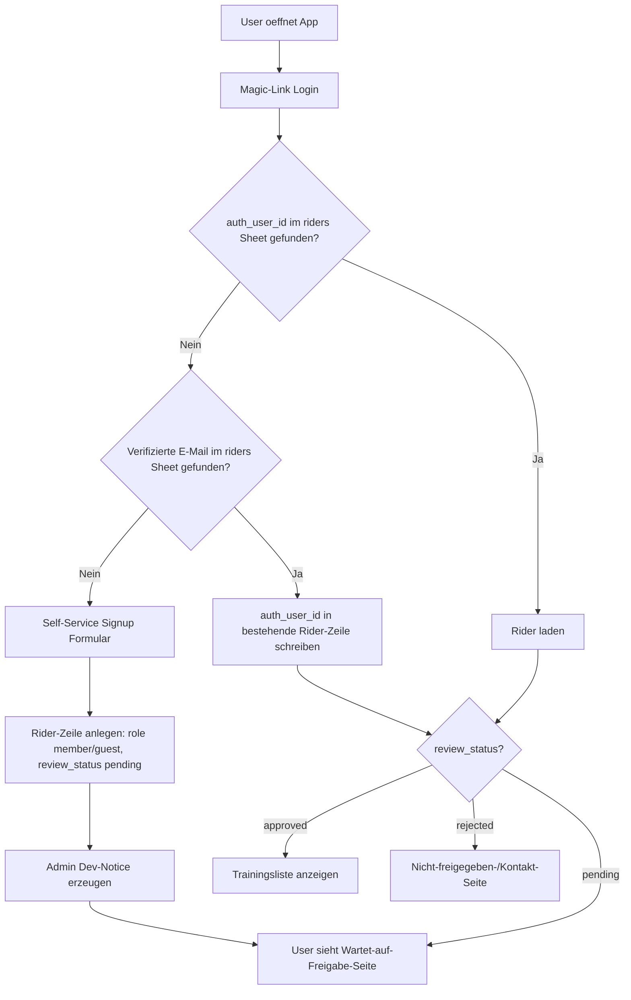
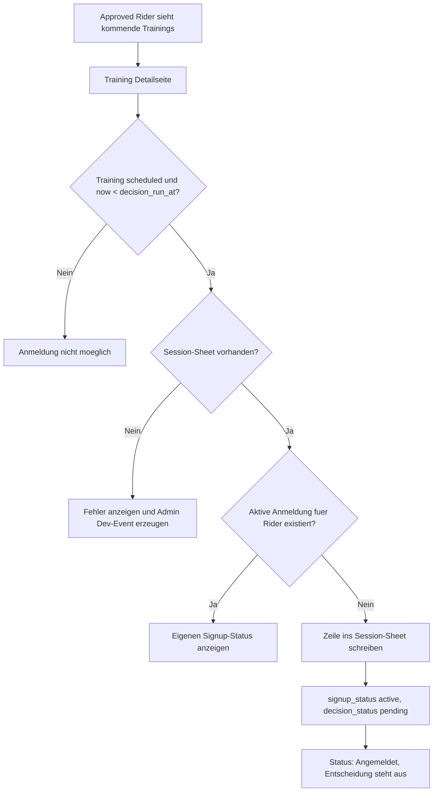
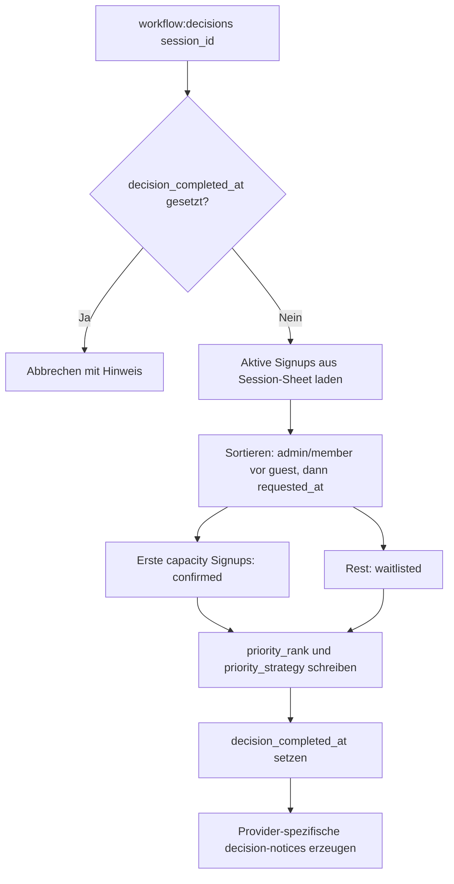
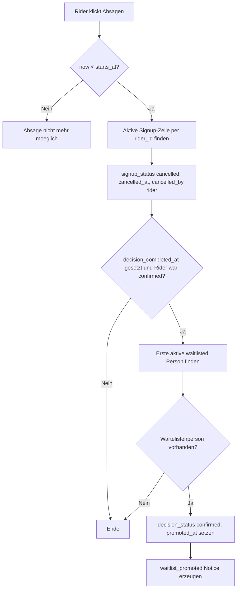
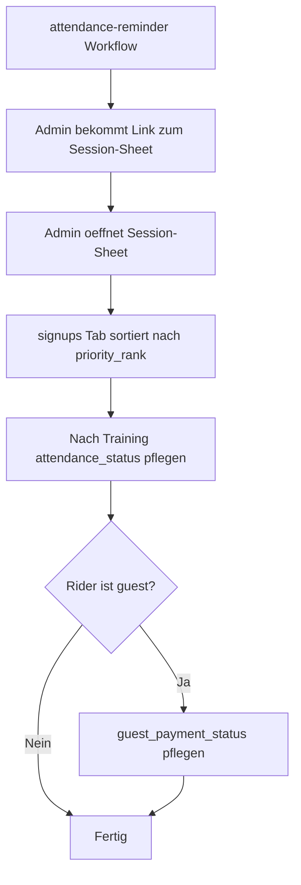

# PLAN: Vereins-Webapp mit Google Sheets Backend

Dieses Dokument beschreibt den geplanten MVP fuer eine Vereins-Webapp. Es soll zuerst als fachliches Abstimmungsdokument fuer den Verein dienen. Technische Details stehen deshalb bewusst weiter hinten.

## 1. Zielbild

Wir wollen eine Webapp bauen, ueber die Rider Trainings sehen, sich anmelden, ihren eigenen Status pruefen und bei Bedarf absagen koennen.

Die Vereinsverwaltung bleibt in Google Sheets:

- Rider/Personen werden in einem Google Sheet gepflegt.
- Trainingstermine werden in einem Google Sheet gepflegt.
- Pro Training gibt es ein eigenes Signup-/Attendance-Google-Sheet.
- Admins koennen Attendance und Gastzahlungen direkt im jeweiligen Training-Sheet pflegen.

Es werden zwei technische Varianten gebaut, um Auth zu vergleichen:

- Variante A: Clerk
- Variante B: Better Auth

Beide Varianten haben denselben fachlichen Scope. Sie nutzen getrennte Google-Sheets-Environments, damit die Tests sich nicht gegenseitig beeinflussen.

## 2. MVP in Kurzform

Der MVP umfasst:

- Magic-Link-Login
- Self-Service-Signup fuer neue Rider
- Admin-Freigabe neuer Rider im Google Sheet
- Liste kommender Trainings
- Training-Detailseite
- Anmeldung zu Trainings
- Platzvergabe per Entscheidungsworkflow
- Warteliste
- automatische Nachruecklogik bei Absage
- Attendance Tracking im Session-Sheet
- Gastzahlungsstatus im Session-Sheet
- Dev-Mail-Adapter statt echter E-Mails
- Magic Links im Dev-Modus sichtbar im Terminal/Dev-Event
- Terminal-Workflows ueber `mise`

Nicht im MVP:

- echte E-Mail-Zustellung
- Admin-UI fuer Workflow-Trigger
- Trainerrollen
- Familienaccounts / mehrere Personen pro Login
- komplexe Priorisierung
- Zahlungsabwicklung
- iCal Feed
- wiederkehrende Trainingsgenerierung
- Social Auth
- Passkeys

## 3. Begriffe

| Begriff | Bedeutung |
| --- | --- |
| Verein | Die Organisation. Im MVP gibt es genau einen Verein pro Environment. |
| Rider | Person, die sich anmelden und an Trainings teilnehmen kann. |
| Mitglied | Rider mit Jahresmitgliedschaft/Jahresbeitrag. Wird vor Gaesten priorisiert. |
| Gastfahrer | Rider ohne Jahresmitgliedschaft. Darf teilnehmen, zahlt pro Training und wird nach Mitgliedern priorisiert. |
| Admin | Rider mit Verwaltungsrechten. Admins duerfen im MVP auch fahren und werden wie Mitglieder priorisiert. |
| Training | Konkreter Trainingstermin an einer Anlage. |
| Anmeldung | Rider meldet Interesse an einem Training an. Das ist noch keine Zusage. |
| Zusage | Rider hat einen Platz bekommen. |
| Warteliste | Rider hat keinen Platz, bleibt aber nachrueckbereit. |
| Absage durch Rider | Rider gibt Anmeldung oder bestaetigten Platz zurueck. |
| Attendance | Nach dem Training erfasster Ist-Zustand. |
| No-show | Rider war bestaetigt, ist nicht erschienen und hat nicht vorher abgesagt. |
| Gastzahlung | Zahlungsstatus eines Gastfahrers fuer ein konkretes Training. |

Wichtige Trennung:

- `confirmed` beschreibt die Planung vor dem Training.
- `present`, `no_show` oder `excused` beschreibt die Realitaet nach dem Training.
- Ein bestaetigter Rider, der rechtzeitig absagt, wird nicht als `no_show` gewertet.

## 4. Rollen und Freigabe

Rollen im MVP:

- `admin`
- `member`
- `guest`

Freigabestatus:

- `pending`: Signup wartet auf Admin-Freigabe
- `approved`: Rider darf die App nutzen und Trainings buchen
- `rejected`: Rider wurde nicht freigegeben

Zugriffsregel:

```text
role in admin/member/guest
AND review_status = approved
```

Nur approved Rider duerfen Trainings sehen und sich anmelden.

Self-Service-Signup:

- Nutzer meldet sich per Magic Link an.
- Falls seine verifizierte E-Mail nicht im Riders-Sheet steht, legt die App einen neuen Rider an.
- Im Signup waehlt die Person `member` oder `guest`.
- Self-Service darf niemals `admin` setzen.
- Neue Self-Service-Rider bekommen `review_status = pending`.
- Admins pruefen neue Rider im Google Sheet und setzen `review_status = approved` oder `rejected`.

Manuell vorab gepflegte Rider:

- Admin/Sheet-Pfleger traegt Rider ins Sheet ein.
- `review_status = approved`.
- `auth_user_id` bleibt leer, bis sich die Person zum ersten Mal per Magic Link einloggt.
- Beim ersten Login matched die App ueber die verifizierte E-Mail und schreibt `auth_user_id`.

## 5. Zentrale User Flows

### 5.1 Signup und Freigabe



### 5.2 Training anmelden



### 5.3 Entscheidung und Warteliste



### 5.4 Absage und Nachruecken



### 5.5 Attendance Tracking



## 6. Trainings- und Anmeldeverhalten

Trainings:

- Trainingstermine werden im MVP nur im Google Sheet gepflegt.
- Die App schreibt keine Trainingstermine.
- Alle zukuenftigen `scheduled` Trainings sind fuer approved Rider sichtbar.
- Es gibt keine Trainingsgruppen, Level oder Altersgruppen im MVP.
- Sonderaktionen und Trainingsserien sind nicht Teil des MVP.

Anmeldungen:

- Ein Rider kann pro Training nur eine aktive Anmeldung haben.
- Nach Absage darf er sich erneut anmelden; dann mit neuem `requested_at` und neuer Prioritaet.
- Neue Anmeldungen sind nur bis `decision_run_at` erlaubt.
- Wenn `now >= decision_run_at`, nimmt die App keine neuen Anmeldungen mehr an, auch wenn der Entscheidungsworkflow noch nicht gelaufen ist.
- Vor der Entscheidung ist der Status: "Angemeldet, Entscheidung steht aus".

Platzvergabe:

- Plaetze gelten erst nach dem Entscheidungsworkflow als bestaetigt.
- Priorisierung im MVP: zuerst `admin` und `member`, danach `guest`; innerhalb jeder Gruppe nach `requested_at`.
- Der Entscheidungsworkflow schreibt `priority_rank` und `priority_strategy`.
- `priority_strategy` kann z. B. `member_guest_fcfs_v1` sein.

Warteliste:

- Personen ausserhalb der Kapazitaet bleiben auf aktiver Warteliste.
- Es gibt keine harte Wartelisten-Kapazitaet.
- Es gibt keine automatische finale Absage fuer uebrig gebliebene Wartelistenpersonen.
- Wartelistenplaetze werden per Notice kommuniziert.

Absagen:

- Rider duerfen selbst absagen, solange `now < starts_at`.
- Bei Absage vor `decision_completed_at` wird nur storniert.
- Bei Absage eines bestaetigten Riders nach Decision rueckt automatisch die erste waitlisted Person nach.
- Bei Absage eines waitlisted Riders wird nur storniert.
- Training-Absage ist etwas anderes als Rider-Absage.

Attendance:

- Attendance wird im MVP direkt im Session-Sheet gepflegt.
- `attendance_status = unknown | present | no_show | excused`
- Bei stornierten Anmeldungen bleibt `attendance_status = unknown`.
- `excused` ist fuer nachtraegliche Bewertung gedacht, nicht fuer normale Stornos.

Gastzahlung:

- Gastzahlungen werden im Session-Sheet gepflegt.
- `guest_payment_status = not_required | open | paid | waived`
- Beim Signup setzt die App:
  - `guest -> open`
  - `member/admin -> not_required`

## 7. Google-Sheets-Struktur

Jedes App-Environment hat eigene Google Sheets:

- `club_riders`
- `club_training`
- ein Drive-Ordner fuer Session-Sheets

Clerk und Better Auth nutzen getrennte Environments. Dadurch bleiben die fachlichen Spalten generisch und es gibt keine Spalten wie `clerk_user_id` oder `better_auth_user_id`.

### 7.1 Spreadsheet `club_riders`

Tab: `riders`

| Spalte | Zweck |
| --- | --- |
| `rider_id` | stabile app-generierte Rider-ID, z. B. `rider_<ulid>` |
| `auth_user_id` | stabile User-ID des Auth-Systems dieses Environments |
| `email` | verifizierte Login-/Kontakt-E-Mail |
| `first_name` | Vorname |
| `last_name` | Nachname |
| `role` | `admin`, `member`, `guest` |
| `review_status` | `pending`, `approved`, `rejected` |
| `onboarding_invite_sent_at` | Zeitpunkt der letzten Onboarding-Einladung |
| `notes` | interne Notizen |

Regeln:

- `email` wird mit `trim().toLowerCase()` gematched.
- Mehrere Rider-Zeilen mit derselben E-Mail sind ein Fehler und muessen manuell bereinigt werden.
- E-Mail-Aenderungen sind nicht Teil des MVP.
- Telefonnummer, Adresse, Geburtsdatum und `created_at`/`updated_at` sind nicht Teil des MVP.

### 7.2 Spreadsheet `club_training`

Tab: `training_sessions`

| Spalte | Zweck |
| --- | --- |
| `session_id` | manuell gepflegte, eindeutige Trainings-ID, z. B. `T-001` |
| `title` | Name des Trainings |
| `starts_at` | Startzeitpunkt als Google-Sheets Datum/Zeit-Zelle |
| `ends_at` | Endzeitpunkt als Google-Sheets Datum/Zeit-Zelle |
| `location` | Anlage/Ort als Freitext |
| `capacity` | maximale Teilnehmerzahl |
| `invite_send_at` | geplanter Zeitpunkt fuer Training-Invites |
| `invite_sent_at` | wann Training-Invites erzeugt/gesendet wurden |
| `decision_run_at` | geplanter Zeitpunkt fuer Platzentscheidung |
| `decision_completed_at` | wann die fachliche Platzentscheidung abgeschlossen wurde |
| `decision_notices_sent_at` | wann Decision-Notices erzeugt/gesendet wurden |
| `attendance_reminder_send_at` | geplanter Zeitpunkt fuer Admin-Attendance-Reminder |
| `attendance_reminder_sent_at` | wann Admin-Attendance-Reminder erzeugt/gesendet wurde |
| `signups_spreadsheet_id` | technische Spreadsheet-ID der Session-Datei |
| `signups_spreadsheet_url` | Link zur Session-Datei fuer Admins |
| `status` | `scheduled`, `cancelled` |

Regeln:

- `session_id` muss gesetzt und eindeutig sein.
- Zeitwerte werden als echte Google-Sheets Datum/Zeit-Zellen gepflegt.
- Die App interpretiert Zeiten mit `APP_TIMEZONE`.
- `status = cancelled` blockiert neue Anmeldungen.
- Bestehende Signups bleiben bei Training-Absage als Historie erhalten.

### 7.3 Pro Training: Session-Sheet

Pro Training gibt es ein eigenes Google Spreadsheet als Source of Truth fuer Signups und Attendance.

Tabs:

- `info`
- `signups`

`info`:

- einfache Key-Value-Tabelle: `key | value`
- wird durch Workflows aus `training_sessions` synchronisiert
- ist Arbeitskopie fuer Menschen, nicht Source of Truth

`signups`:

| Spalte | Zweck |
| --- | --- |
| `rider_id` | Referenz auf Rider |
| `rider_name` | Snapshot fuer manuelle Lesbarkeit |
| `rider_role` | Snapshot fuer Priorisierung/Attendance |
| `requested_at` | Zeitpunkt der Anmeldung |
| `signup_status` | `active`, `cancelled` |
| `decision_status` | `pending`, `confirmed`, `waitlisted` |
| `priority_rank` | vom Entscheidungsworkflow geschriebener Rang |
| `priority_strategy` | verwendete Ranglogik, z. B. `member_guest_fcfs_v1` |
| `promoted_at` | Zeitpunkt des Nachrueckens |
| `cancelled_at` | Absagezeitpunkt |
| `cancelled_by` | `rider`, `admin` |
| `attendance_status` | `unknown`, `present`, `no_show`, `excused` |
| `guest_payment_status` | `not_required`, `open`, `paid`, `waived` |

Regeln:

- Kein `signup_id` im MVP.
- Praktischer Key: `rider_id + requested_at`.
- Pro Session-Sheet darf pro `rider_id` nur eine aktive Anmeldung existieren.
- `rider_name` und `rider_role` sind Snapshots zum Zeitpunkt der Anmeldung.
- Spaetere Aenderungen im Riders-Sheet werden nicht automatisch in alte Session-Sheets synchronisiert.

## 8. Workflows

Workflows sind idempotente serverseitige Funktionen und werden im MVP per Terminal-Task ausgefuehrt. Spaeter koennen dieselben Workflows scheduled laufen.

### 8.1 Rider/Auth Workflows

Provider-spezifisch:

```text
mise run clerk:onboarding-invites
mise run clerk:onboarding-invite -- <rider_id>
mise run clerk:training-invites -- <session_id>
mise run clerk:decision-notices -- <session_id>

mise run better-auth:onboarding-invites
mise run better-auth:onboarding-invite -- <rider_id>
mise run better-auth:training-invites -- <session_id>
mise run better-auth:decision-notices -- <session_id>
```

Regeln:

- Onboarding-Invites gehen an approved Rider ohne `auth_user_id`.
- Training-Invites gehen an alle approved Rider, auch ohne `auth_user_id`.
- Magic Links werden kurzlebig zur Versandzeit erzeugt und nicht im Sheet gespeichert.
- Im Dev-Modus werden Links im Terminal/Dev-Event angezeigt.

### 8.2 Training/Sheet Workflows

Provider-neutral:

```text
mise run workflow:sync-session-sheets
mise run workflow:create-session-sheet -- <session_id>
mise run workflow:fill-session-defaults
mise run workflow:decisions -- <session_id>
mise run workflow:wipe-decision -- <session_id>
mise run workflow:promote-waitlist -- <session_id>
mise run workflow:cancel-training -- <session_id>
mise run workflow:attendance-reminder -- <session_id>
```

`sync-session-sheets`:

- kopiert eine Google-Sheets-Template-Datei fuer fehlende Session-Sheets
- schreibt `signups_spreadsheet_id` und `signups_spreadsheet_url` zurueck
- aktualisiert den `info`-Tab
- validiert Spalten
- warnt bei ueberfluessigen Session-Sheets, loescht aber nichts
- benennt bestehende Dateien nicht automatisch um

`fill-session-defaults`:

- setzt fehlende `invite_send_at`, `decision_run_at`, `attendance_reminder_send_at`
- nutzt Env Defaults:
  - `DEFAULT_INVITE_DAYS_BEFORE`
  - `DEFAULT_DECISION_DAYS_BEFORE`
  - `DEFAULT_ATTENDANCE_REMINDER_HOURS_BEFORE`
- Default-Zeitpunkte werden relativ zu `starts_at` berechnet

`workflow:decisions`:

- bricht ab, wenn `decision_completed_at` gesetzt ist
- liest aktive Signups aus dem Session-Sheet
- sortiert `admin/member` vor `guest`, dann `requested_at`
- setzt `confirmed` fuer die ersten `capacity`
- setzt `waitlisted` fuer den Rest
- schreibt `priority_rank` und `priority_strategy`
- setzt `decision_completed_at`
- verschickt keine provider-spezifischen Notices

`workflow:wipe-decision`:

- loescht keine Anmeldungen
- setzt `decision_completed_at` leer
- setzt betroffene Signups fachlich zurueck auf `pending`

`workflow:cancel-training`:

- setzt `training_sessions.status = cancelled`
- laesst Signup-Status unveraendert
- erzeugt `training_cancelled` Notices fuer alle Signups
- bricht ab, wenn Training bereits `cancelled` ist

`workflow:attendance-reminder`:

- erzeugt Admin-Reminder mit Link zum Session-Sheet
- nutzt `attendance_reminder_sent_at` fuer Idempotenz

## 9. Notices und E-Mail

Im MVP werden keine echten E-Mails versendet. Stattdessen gibt es einen E-Mail-Adapter:

- MVP: `devlog`
- spaeter: Brevo oder Mailgun

MVP-Notice-Typen:

- `onboarding_invite`
- `signup_pending_admin_notice`
- `training_invite`
- `decision_confirmed`
- `decision_waitlisted`
- `waitlist_promoted`
- `training_cancelled`
- `attendance_admin_reminder`

Admin-Notices:

- gehen an Rider mit `role = admin` und `review_status = approved`
- wenn kein approved Admin gefunden wird, warnen App/Workflow hart

Training-Invites:

- sind Reminder, keine Zugangsvoraussetzung
- approved Rider koennen sich auch ohne Invite einloggen und anmelden

Decision-Notices:

- werden provider-spezifisch nach `workflow:decisions` erzeugt
- `decision_confirmed` enthaelt Link zur Training-Detailseite
- auf der Detailseite kann der Rider absagen

## 10. App-UI

MVP UI:

- Login per Magic Link
- Self-Service-Signup
- Pending-Review-Seite
- Rejected-/Kontakt-Seite
- Liste kommender Trainings
- Training-Detailseite
- eigener Signup-Status
- Button: anmelden
- Button: absagen

Trainingsliste:

- zeigt nur `status = scheduled`
- zeigt nur Trainings mit `starts_at >= now`

Training-Detailseite:

- Titel
- Zeit
- Ort
- eigener Status
- Button fuer Anmeldung/Absage

Status-Texte:

- `pending`: "Angemeldet, Entscheidung steht aus"
- `confirmed`: "Platz bestaetigt"
- `waitlisted`: "Warteliste"

Nicht im MVP:

- Wartelistenposition anzeigen
- Teilnehmerliste fuer Rider
- Attendance-UI
- Admin-UI fuer Workflow-Trigger

## 11. Technische Umsetzung

Stack:

- Next.js App Router
- React
- TypeScript
- Tailwind CSS
- shadcn/ui
- lucide-react
- pnpm workspaces
- Node 24 LTS
- pnpm 10
- `mise.toml` fuer lokale Dev-Env, Tool-Versionen und Tasks
- keine `.nvmrc`, keine `.node-version`

Monorepo:

```text
apps/
  club-clerk/
  club-better-auth/
packages/
  ui/
  domain/
  sheets/
  workflows/
  email/
  config/
```

Architekturregel:

- Domain-, Sheets- und Workflow-Logik wird einmal geteilt implementiert.
- Auth-, Session- und Magic-Link-/Notice-Raender werden pro App adaptiert.
- Shared UI liegt in `packages/ui`.
- Auth-Seiten und Auth-Provider bleiben app-spezifisch.

Better Auth:

- nutzt im MVP SQLite nur fuer lokal/dev bzw. Prototyp-Vergleich
- Production-Persistenz wird spaeter entschieden
- E-Mail/Passwort ist nicht vorgesehen

Clerk:

- nutzt im MVP Magic-Link-Login
- Clerk Organizations sind fuer den MVP nicht gesetzt

## 12. Environment-Konfiguration

Fachliche Env:

```text
APP_BASE_URL
APP_TIMEZONE=Europe/Berlin
CLUB_NAME
SUPPORT_EMAIL
CLUB_RIDERS_SPREADSHEET_ID
CLUB_TRAINING_SPREADSHEET_ID
SESSION_SHEET_TEMPLATE_ID
SESSION_SHEETS_FOLDER_ID
DEFAULT_INVITE_DAYS_BEFORE
DEFAULT_DECISION_DAYS_BEFORE
DEFAULT_ATTENDANCE_REMINDER_HOURS_BEFORE
```

Dazu kommen:

- Google Service Account Env
- Clerk Env fuer `apps/club-clerk`
- Better Auth Env fuer `apps/club-better-auth`

Technische Google-IDs liegen in Env, nicht in fachlichen Sheets.

## 13. Spaeter

Bewusst spaeter:

- echte E-Mail-Zustellung mit Brevo oder Mailgun
- Scheduler, z. B. Vercel Cron, GitHub Actions oder Cloudflare Cron
- Workflow-Trigger in Admin-UI
- Admin-/Attendance-UI
- Trainerrolle
- Readonly-Rolle
- Sperr-/Deaktivierungsstatus fuer Rider
- Familienaccounts / mehrere Personen pro Login
- Minderjaehrige / Erziehungsberechtigte
- Telefonnummer, Adresse, Geburtsdatum
- komplexere Priorisierung
- Zahlungsabwicklung
- iCal Feed fuer Trainingstermine
- Trainingsserien
- echte Audit-Logs
- Environment-Clone-/Seed-Workflow
- Social Auth
- Passkeys

## 14. Noch zu klaeren

Fachlich:

- Wer pflegt `club_riders` und `club_training` direkt?
- Wer darf Session-Sheets bearbeiten?
- Soll es eine formale Regel geben, wann eine Absage spaet ist?
- Reicht `notes` im Riders-Sheet fuer interne Hinweise?

Technisch:

- Soll es eine persistente Dev-Mail-History geben oder reicht Terminal/Dev-Event?
- Wird `workflow:*` als gemeinsames CLI-Package umgesetzt?
- Wie genau werden Google-Sheets DateTime-Zellen geparst und geschrieben?
- Welche Better-Auth-Plugins brauchen wir konkret fuer Magic Links?
